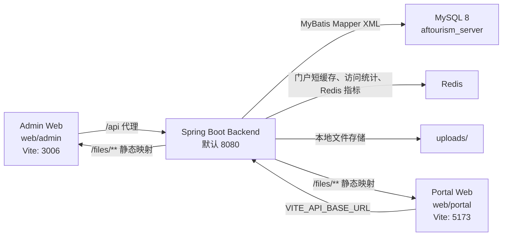
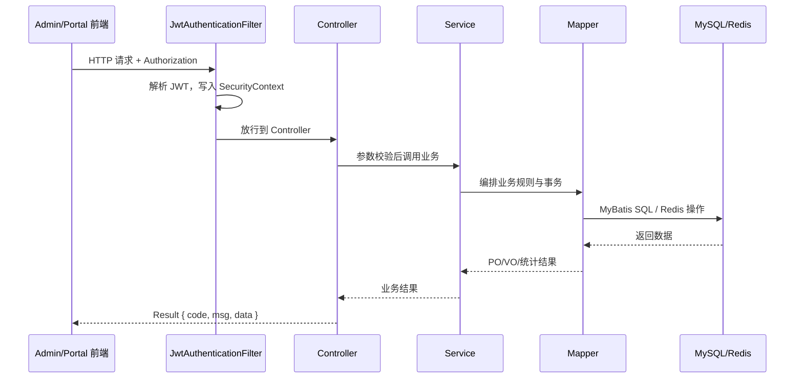

# Aftourism 开发者手册

本文档面向第一次接手 Aftourism 的开发人员，目标是让你在较短时间内完成三件事：能把项目跑起来，能看懂主要业务链路，能知道新增功能时应该改哪些层、同步哪些文档。

本文档基于当前仓库代码整理。请始终把代码作为第一事实源；已有文档只能作为导航和辅助说明。数据库结构以最新全量备份 [docs/SQL/全量备份2026-4-22.sql](SQL/全量备份2026-4-22.sql) 为准，接口细节优先对照 Controller、DTO/VO、Mapper XML，再参考 [docs/login](login)、[docs/RBAC](RBAC) 与 [docs/PortalAPI](PortalAPI) 下的 OpenAPI 文档。

## 1. 项目总览

Aftourism 是一个前后端分离的文旅服务平台，后端是 Spring Boot 单体应用，前端分为管理后台与前台门户两个 Vue 应用。

| 子系统 | 路径 | 主要职责 |
| --- | --- | --- |
| 后端服务 | `src/main/java/aftnos/aftourismserver` | 认证授权、后台管理、门户接口、文件上传、监控统计 |
| 管理后台 | `web/admin` | 管理员登录、动态菜单、内容管理、活动审核、用户/RBAC、监控看板 |
| 前台门户 | `web/portal` | 用户注册登录、新闻公告、景区场馆、活动申报、收藏、留言、交流区 |
| 数据库脚本 | `docs/SQL/全量备份2026-4-22.sql` | 最新数据库结构、基础菜单/权限数据与当前数据快照 |
| API 文档 | `docs/login`、`docs/RBAC`、`docs/PortalAPI` | 登录、RBAC、门户与后台补充接口说明 |

核心技术栈：

| 层级 | 技术 |
| --- | --- |
| 后端 | Java 21、Spring Boot 3.5.7、Spring Security、JWT、MyBatis、PageHelper、Redis、MySQL |
| Admin Web | Vue 3.5、TypeScript、Vite 7、Pinia、Vue Router、Element Plus、Tailwind CSS、ECharts |
| Portal Web | Vue 3.5、TypeScript、Vite 5、Pinia、Vue Router、Element Plus、Axios |
| 构建 | Maven、pnpm、npm |

## 2. 架构与数据流

整体运行关系如下：



后端是一个单体 Spring Boot 应用，但按业务边界拆成多个包：

```text
aftnos.aftourismserver
├── common   # 通用响应、异常、安全、AOP、配置、工具、拦截器
├── auth     # 管理员/门户用户认证、用户信息、菜单查询
├── admin    # 管理后台业务接口与服务
├── portal   # 前台门户业务接口与服务
├── file     # 文件上传与存储
└── monitor  # Redis 指标、运行时指标、访问统计
```

典型请求链路：



## 3. 本地启动

### 3.1 环境要求

- JDK 21+
- Maven 3.8+
- MySQL 8+
- Redis 6+
- Node.js：Admin 需要 `>=20.19.0`，Portal 需要 Node 18+ 即可
- pnpm：Admin 推荐 `>=8.8.0`

### 3.2 数据库与 Redis

1. 创建数据库并导入最新全量备份：

```bash
mysql -u root -p < "docs/SQL/全量备份2026-4-22.sql"
```

2. 确认 [src/main/resources/application.yml](../src/main/resources/application.yml) 中的连接信息：

```yaml
spring:
  datasource:
    url: jdbc:mysql://localhost:3306/aftourism_server?useSSL=false&serverTimezone=UTC&characterEncoding=utf8
    username: root
    password: 123456
  data:
    redis:
      host: localhost
      port: 6379
```

3. 启动本地 Redis。门户缓存、访问统计、Redis 监控都依赖 Redis；部分逻辑有降级，但建议开发环境保持 Redis 可用。

### 3.3 后端启动

在仓库根目录执行：

```bash
mvn spring-boot:run
```

或先打包再运行：

```bash
mvn clean package
java -jar target/Aftourism-server-0.0.1-SNAPSHOT.jar
```

后端默认使用 8080 端口。若需要临时改端口，建议通过命令行传入：

```bash
mvn spring-boot:run -Dspring-boot.run.arguments="--server.port=8081"
```

### 3.4 管理后台启动

```bash
cd web/admin
pnpm install
pnpm dev
```

关键配置：

- [web/admin/.env](../web/admin/.env)：`VITE_PORT = 3006`，`VITE_ACCESS_MODE = backend`
- [web/admin/.env.development](../web/admin/.env.development)：`VITE_API_URL = /`，`VITE_API_PROXY_URL = http://localhost:8080`
- [web/admin/vite.config.ts](../web/admin/vite.config.ts)：`/api` 会代理到后端并移除 `/api` 前缀，`/files` 也代理到后端

因此前端代码里请求 `/api/admin/auth/login`，实际到后端会变成 `/admin/auth/login`。

### 3.5 前台门户启动

```bash
cd web/portal
npm install
npm run dev
```

关键配置：

- [web/portal/.env](../web/portal/.env)：`VITE_API_BASE_URL=http://localhost:8080/`
- [web/portal/vite.config.ts](../web/portal/vite.config.ts)：开发端口 5173

Portal 不通过 `/api` 代理，Axios 直接访问 `VITE_API_BASE_URL`。

### 3.6 常用检查命令

```bash
# 后端测试
mvn test

# Admin 类型检查与构建
cd web/admin
pnpm build

# Portal 类型检查与构建
cd web/portal
npm run build
```

当前仓库的主要自动化测试位于 [src/test/java/aftnos/aftourismserver](../src/test/java/aftnos/aftourismserver)，包含认证集成、新闻服务、操作日志等基础测试。

## 4. 后端代码地图

### 4.1 启动与全局配置

| 文件 | 作用 |
| --- | --- |
| [AftourismServerApplication.java](../src/main/java/aftnos/aftourismserver/AftourismServerApplication.java) | Spring Boot 启动入口，启用 `@ConfigurationPropertiesScan` 与 `@EnableScheduling` |
| [application.yml](../src/main/resources/application.yml) | 数据库、Redis、JWT、文件上传、监控、日志配置 |
| [WebMvcConfig.java](../src/main/java/aftnos/aftourismserver/common/config/WebMvcConfig.java) | 注册访问统计拦截器，映射 `/files/**` 到本地上传目录 |
| [RedisConfig.java](../src/main/java/aftnos/aftourismserver/common/config/RedisConfig.java) | RedisTemplate 序列化配置 |
| [PasswordEncoderConfig.java](../src/main/java/aftnos/aftourismserver/common/config/PasswordEncoderConfig.java) | BCrypt 密码编码器 |

### 4.2 common：公共基础设施

`common` 是所有模块的基础包：

- `common.result`：统一响应 `Result<T>` 和状态码 `ResultCode`。
- `common.vo`：通用 VO，例如 `PageResponse<T>`、`FileUploadVO`。
- `common.exception`：业务异常、未授权异常、全局异常处理。
- `common.security`：Spring Security、JWT 过滤器、主体对象、RBAC 权限服务。
- `common.aop`：操作日志切面。
- `common.interceptor`：站点访问统计拦截器。
- `common.util`：JWT、HTTP、IP 等工具类。

真实响应字段是：

```json
{
  "code": 200,
  "msg": "成功",
  "data": {}
}
```

注意字段名是 `msg`，不是 `message`。前端 HTTP 封装也是按 `msg` 处理。

### 4.3 auth：认证、用户信息、菜单

入口：

| Controller | 路径 | 职责 |
| --- | --- | --- |
| [AdminAuthController.java](../src/main/java/aftnos/aftourismserver/auth/controller/AdminAuthController.java) | `/admin/auth` | 管理员登录、当前管理员信息、动态菜单 |
| [PortalAuthController.java](../src/main/java/aftnos/aftourismserver/portal/controller/PortalAuthController.java) | `/portal/auth` | 门户注册登录、当前用户资料、资质申请 |

核心服务：

- [AdminAuthServiceImpl.java](../src/main/java/aftnos/aftourismserver/auth/service/impl/AdminAuthServiceImpl.java)：管理员用户名密码校验、状态校验、签发 ADMIN 或 SUPER_ADMIN JWT。
- [PortalAuthServiceImpl.java](../src/main/java/aftnos/aftourismserver/auth/service/impl/PortalAuthServiceImpl.java)：门户用户注册、BCrypt 加密、默认角色 `PORTAL_USER`、签发门户 JWT。
- [AdminUserInfoServiceImpl.java](../src/main/java/aftnos/aftourismserver/auth/service/impl/AdminUserInfoServiceImpl.java)：读取当前管理员、角色、按钮权限。
- [PortalUserInfoServiceImpl.java](../src/main/java/aftnos/aftourismserver/auth/service/impl/PortalUserInfoServiceImpl.java)：读取和更新当前门户用户资料。
- [MenuQueryServiceImpl.java](../src/main/java/aftnos/aftourismserver/auth/service/impl/MenuQueryServiceImpl.java)：按当前管理员角色加载动态菜单树。

核心表：

- `t_admin`：管理员账号。
- `t_user`：门户用户。
- `t_user_qualification_apply`：门户用户资质申请。
- `t_menu`、`t_menu_permission`、`t_role_menu`、`t_role_menu_permission`：动态菜单与按钮权限。
- `t_role_access`：后台资源动作权限。

### 4.4 admin：管理后台业务

`admin` 包按后台功能拆 Controller、Service、Mapper、DTO、VO、POJO。

主要 Controller 分组：

| 模块 | Controller | API 前缀 | 说明 |
| --- | --- | --- | --- |
| 新闻 | `NewsController` | `/admin/news` | 新闻新增、编辑、删除、分页 |
| 公告 | `NoticeController` | `/admin/notice` | 公告新增、编辑、删除、分页 |
| 景区 | `ScenicSpotController` | `/admin/scenic` | 景区内容管理 |
| 场馆 | `VenueController` | `/admin/venue` | 场馆内容管理 |
| 活动审核 | `ActivityController` | `/admin/activity` | 通过/驳回门户提交的活动 |
| 活动管理 | `ActivityManageController` | `/admin/activity/manage` | 后台活动 CRUD 与评论管理 |
| 首页配置 | `HomeContentController` | `/admin/home` | Banner、简介、推荐景区 |
| 回收站 | `RecycleBinController` | `/admin/recycle` | 已逻辑删除内容恢复/彻底删除 |
| 管理员 | `AdminAccountController` | `/admin/rbac/admins` | 管理员账号管理 |
| 门户用户 | `PortalUserManageController` | `/admin/rbac/users` | 门户用户角色/状态管理 |
| 菜单 | `MenuManageController` | `/admin/rbac/menus` | 菜单与按钮权限维护 |
| RBAC | `RoleAccessController`、`RoleMenuPermissionController` | `/admin/rbac`、`/admin/rbac/roles` | 角色资源权限、角色菜单权限 |
| 留言反馈 | `MessageFeedbackManageController` | `/admin/feedback/manage` | 留言反馈审核与管理 |
| 交流区 | `ExchangeArticleManageController`、`ExchangeCommentManageController` | `/admin/exchange` | 交流文章、评论、举报管理 |
| 资质审核 | `UserQualificationController` | `/admin/qualification` | 门户高级用户资质审核 |
| 监控看板 | `PortalDashboardController`、`MonitorRuntimeController` | `/admin/dashboard/portal`、`/admin/monitor` | 门户数据与运行时指标 |
| 系统设置 | `AdminSystemSettingController`、`OperationLogController` | `/admin/system/backend` | 水印、操作日志 |

后台接口通常使用 `@PreAuthorize("@rbacAuthority.hasPermission(...)")` 做方法级权限校验。新增后台接口时，应同步考虑权限枚举、角色授权数据、前端按钮标识。

### 4.5 portal：前台门户业务

门户包提供终端用户访问接口，读接口对未登录用户开放，互动/个人接口要求登录。

主要 Controller：

| 模块 | Controller | API 前缀 | 说明 |
| --- | --- | --- | --- |
| 首页 | `HomePortalController` | `/portal/home` | 首页聚合内容 |
| 新闻 | `NewsPortalController` | `/portal/news` | 新闻列表与详情 |
| 公告 | `NoticePortalController` | `/portal/notice` | 公告列表与详情 |
| 景区 | `ScenicSpotPortalController` | `/portal/scenic` | 景区列表、详情、地图数据 |
| 场馆 | `VenuePortalController` | `/portal/venue` | 场馆列表、详情、地图数据 |
| 活动 | `ActivityPortalController` | `/portal/activity` | 活动列表、详情、申报、评论 |
| 收藏 | `UserFavoriteController` | `/portal/fav` | 收藏/取消收藏/收藏列表 |
| 留言反馈 | `MessageFeedbackPortalController` | `/portal/feedback` | 留言发布、详情、评论、点赞 |
| 交流区 | `ExchangePortalController` | `/portal/exchange` | 文章发布、审核后展示、评论、点赞 |
| 举报 | `ContentReportPortalController` | `/portal/report` | 对交流内容或评论发起举报 |
| 通知 | `PortalNotificationController` | `/portal/notification` | 个人通知分页、已读 |
| 用户主页 | `PortalUserController` | `/portal/user` | 用户公开主页 |

门户查询服务大量复用 `admin.mapper` 中的内容 Mapper，例如新闻、景区、场馆使用同一批 XML Mapper，但门户 SQL 会过滤已发布、未删除、已审核数据。

### 4.6 file：文件上传

文件模块入口是 [FileUploadController.java](../src/main/java/aftnos/aftourismserver/file/controller/FileUploadController.java)，API 为：

```http
POST /file/upload
Content-Type: multipart/form-data
Authorization: <token> 或 Bearer <token>
```

核心实现：

- [FileStorageProperties.java](../src/main/java/aftnos/aftourismserver/file/config/FileStorageProperties.java)：绑定 `file.*` 配置。
- [LocalFileStorageServiceImpl.java](../src/main/java/aftnos/aftourismserver/file/storage/impl/LocalFileStorageServiceImpl.java)：本地保存文件，按 `bizTag/yyyy/MM/dd/uuid.ext` 组织。
- [OssFileStorageServiceImpl.java](../src/main/java/aftnos/aftourismserver/file/storage/impl/OssFileStorageServiceImpl.java)：当前只是预留实现，尚未完成 OSS 对接。
- [WebMvcConfig.java](../src/main/java/aftnos/aftourismserver/common/config/WebMvcConfig.java)：把上传目录映射成 `/files/**` 静态资源。

默认配置：

```yaml
file:
  upload-dir: ./uploads
  base-url: http://localhost:8080/files
  storage-type: local
  allowed-types:
    - jpg
    - jpeg
    - png
    - gif
    - pdf
    - mp4
```

### 4.7 monitor：监控与统计

监控模块主要做三类事情：

- Redis 指标采集：`RedisMetricsScheduler` 根据 `monitor.redis.collect-interval` 定时调用 `RedisMetricsService`，结果写入 `t_redis_benchmark`。
- 运行时指标：`RuntimeMetricsService` 提供 CPU、内存、线程等运行时信息，后台由 `/admin/monitor/runtime` 查询。
- 访问统计：`SiteVisitStatsInterceptor` 统计 PV/UV/IP/在线访客等，`SiteVisitStatsService` 写 Redis 与 `t_site_visit_stats`。

## 5. 核心机制

### 5.1 JWT 与登录态

JWT 工具在 [JwtUtils.java](../src/main/java/aftnos/aftourismserver/common/util/JwtUtils.java)。Token 里包含：

- `pid`：主体 ID。
- `pt`：主体类型，取值来自 `PrincipalType`，例如 `PORTAL_USER`、`ADMIN`、`SUPER_ADMIN`。
- 过期时间来自 `security.jwt.expiration`，刷新令牌来自 `security.jwt.refresh-expiration`。

[JwtAuthenticationFilter.java](../src/main/java/aftnos/aftourismserver/common/security/JwtAuthenticationFilter.java) 每次请求读取 `Authorization`：

- 支持 `Authorization: Bearer <token>`。
- 也兼容 `Authorization: <token>`。

Admin 前端当前直接写入 token；Portal 前端写入 `Bearer ${token}`。后端过滤器同时兼容这两种格式。

### 5.2 Spring Security 放行规则

[SecurityConfig.java](../src/main/java/aftnos/aftourismserver/common/security/SecurityConfig.java) 是权限入口：

- 开启 CORS、关闭 CSRF、禁用 FormLogin 和 HTTP Basic。
- 使用无状态 Session：`SessionCreationPolicy.STATELESS`。
- 放行登录注册：`/admin/auth/login`、`/portal/auth/login`、`/portal/auth/register`。
- 放行公共读接口：门户首页、新闻、公告、景区、场馆、活动查询、反馈查询、交流查询、用户主页等。
- 需要登录：门户收藏、活动申报、评论互动、举报、通知等。
- `/admin/**` 全部要求登录，具体按钮/资源权限再由 `@PreAuthorize` 控制。

### 5.3 管理员 RBAC

管理员权限分两层：

1. 登录后由 `RbacAuthorityService.buildAdminPrincipal` 根据 `t_admin.role_code`、`t_role_access`、`t_menu_permission` 构建 `AdminPrincipal`。
2. Controller 方法通过 `@PreAuthorize("@rbacAuthority.hasPermission(...)")` 判断资源动作权限。

权限枚举在 [AdminPermission.java](../src/main/java/aftnos/aftourismserver/common/security/AdminPermission.java)，每个权限由 `resourceKey` 与 `action` 组成，例如：

```java
NEWS_CREATE("NEWS", "CREATE", "新闻-新增")
```

超级管理员 `is_super = 1` 会自动拥有全部资源权限和菜单按钮标识。

### 5.4 统一响应与异常

统一响应类在 [Result.java](../src/main/java/aftnos/aftourismserver/common/result/Result.java)：

```java
public class Result<T> {
    private Integer code;
    private String msg;
    private T data;
}
```

异常由 [GlobalExceptionHandler.java](../src/main/java/aftnos/aftourismserver/common/exception/GlobalExceptionHandler.java) 统一处理，重点行为：

- `BusinessException` 返回业务错误。
- `UnauthorizedException` 返回 HTTP 401。
- `AuthorizationDeniedException` 返回 HTTP 403。
- 参数校验异常返回 400。
- 兜底异常返回 500。

### 5.5 分页约定

后端使用 PageHelper。典型写法：

```java
PageHelper.startPage(query.getCurrent(), query.getSize());
List<NewsVO> list = newsMapper.pageList(query);
return new PageInfo<>(list);
```

很多 Controller 当前直接返回 `Result<PageInfo<T>>`。PageInfo JSON 通常包含 `list`、`total`、`pageNum`、`pageSize` 等字段。`common.vo.PageResponse<T>` 也存在，字段为 `records`、`current`、`size`、`total`，但当前并非所有接口统一使用它。新增接口时优先沿用相邻模块已有返回格式，避免前端适配成本。

### 5.6 门户短缓存

门户高频只读接口使用自定义注解 [PortalCacheable.java](../src/main/java/aftnos/aftourismserver/portal/cache/PortalCacheable.java)：

```java
@PortalCacheable(cacheName = "portal:news:page")
```

[PortalCacheAspect.java](../src/main/java/aftnos/aftourismserver/portal/cache/PortalCacheAspect.java) 会用方法参数生成 MD5 摘要作为 Redis key，并设置短 TTL。Redis 读取或写入失败时会降级为数据库直查，不阻断请求。

当前已使用缓存的模块包括门户首页、新闻、公告、景区、场馆、活动详情/列表等。

### 5.7 操作日志 AOP

[OperationLogAspect.java](../src/main/java/aftnos/aftourismserver/common/aop/OperationLogAspect.java) 拦截：

```java
execution(* aftnos.aftourismserver.*.controller..*.*(..))
```

它会记录：

- 操作人 ID 与主体类型。
- 请求 URI、Method、IP、User-Agent。
- Controller 类方法。
- 请求参数和响应体截断内容。
- 耗时、成功标记、错误信息。

日志写入 `t_operation_log`，后台可通过 `/admin/system/backend/operation-logs` 查询。

### 5.8 文件上传链路

前端上传到 `/file/upload`，后端完成扩展名白名单校验和路径规整，保存到 `uploads/{bizTag}/{yyyy/MM/dd}/{uuid}.{ext}`，返回 `FileUploadVO`：

```json
{
  "url": "http://localhost:8080/files/common/2026/05/06/xxx.png",
  "fileName": "xxx.png",
  "originalName": "原始文件名.png",
  "size": 12345
}
```

文件访问由 `/files/**` 静态映射提供。开发时如果改了后端端口，也要同步调整 `file.base-url`，否则前端拿到的访问地址仍指向旧端口。

## 6. 前端代码地图

### 6.1 Admin Web

Admin 基于 Art Design Pro 风格模板二次开发，业务代码在 [web/admin/src](../web/admin/src)。

关键目录：

| 路径 | 作用 |
| --- | --- |
| `src/api` | 后台接口封装，例如 `news.ts`、`activity.ts`、`auth.ts`、`system-manage.ts` |
| `src/router` | 静态路由、动态菜单处理、路由守卫 |
| `src/store` | Pinia 状态，用户、菜单、设置、标签页 |
| `src/views` | 页面组件 |
| `src/components` | 通用组件、业务组件、表格、布局 |
| `src/utils/http` | Axios 实例、统一错误处理、token 注入 |
| `src/config` | 系统主题、布局、门户权限等配置 |

HTTP 封装在 [web/admin/src/utils/http/index.ts](../web/admin/src/utils/http/index.ts)：

- `baseURL` 取 `VITE_API_URL`。
- 请求前从 `useUserStore()` 读取 `accessToken`，写入 `Authorization`。
- `POST` 和 `PUT` 如果传 `params` 且没有 `data`，会自动转成请求体。
- 响应要求 `code === 200`，并返回 `data`。
- 401 会触发登出并跳转登录页。

登录 API 在 [web/admin/src/api/auth.ts](../web/admin/src/api/auth.ts)，调用 `/api/admin/auth/login` 与 `/api/admin/auth/info`。Vite 代理会把 `/api` 去掉。

动态菜单链路：

1. 登录成功后获取用户信息和菜单。
2. 后端 `/admin/auth/menus` 返回菜单树。
3. [MenuProcessor.ts](../web/admin/src/router/core/MenuProcessor.ts) 处理菜单路径、父子关系、iframe、外链、角色等。
4. [ComponentLoader.ts](../web/admin/src/router/core/ComponentLoader.ts) 使用 `import.meta.glob('../../views/**/*.vue')` 动态加载页面。
5. [beforeEach.ts](../web/admin/src/router/guards/beforeEach.ts) 控制登录态、动态路由注入、权限路径校验。

主要业务页面：

| 功能 | 页面路径 |
| --- | --- |
| 新闻管理 | `src/views/news/newspage` |
| 公告管理 | `src/views/notice/noticepage` |
| 景区管理 | `src/views/scenic/scenicpage` |
| 场馆管理 | `src/views/venue/venuepage` |
| 活动管理 | `src/views/activity/activitypage` |
| 活动审核 | `src/views/activity/auditpage` |
| 活动评论 | `src/views/activity/commentpage` |
| 门户用户 | `src/views/system/portal-user` |
| 管理员 | `src/views/system/user` |
| 角色 | `src/views/system/role` |
| 菜单 | `src/views/system/menu` |
| 首页配置 | `src/views/system/home-config` |
| 回收站 | `src/views/system/recycle` |
| 交流区审核 | `src/views/exchange/article-list`、`src/views/exchange/report` |
| 系统后台 | `src/views/system/backend-manage` |

### 6.2 Portal Web

Portal 是面向普通用户的前台应用，业务代码在 [web/portal/src](../web/portal/src)。

关键目录：

| 路径 | 作用 |
| --- | --- |
| `src/services/http.ts` | Axios 实例、token 注入、错误处理 |
| `src/services/portal.ts` | 门户全部接口与 TypeScript 类型 |
| `src/router/index.ts` | 静态路由表 |
| `src/store/user.ts` | 登录态、用户资料、收藏等状态 |
| `src/views` | 首页、新闻、公告、景区、场馆、活动、留言、交流、个人中心 |
| `src/components` | 顶部导航、页脚、进度条、目录导航 |

HTTP 封装在 [web/portal/src/services/http.ts](../web/portal/src/services/http.ts)：

- `baseURL` 取 `VITE_API_BASE_URL`。
- 从 `localStorage.portal_token` 读取 token，并以 `Bearer ${token}` 写入请求头。
- 响应 `code === 200` 时直接返回 `data`。
- 401 会清理门户本地 token、refresh token、用户资料，并跳转 `/login`。

门户接口集中在 [web/portal/src/services/portal.ts](../web/portal/src/services/portal.ts)，包括新闻、公告、景区、场馆、活动、收藏、留言、交流、举报、通知、文件上传、用户主页等。

静态路由在 [web/portal/src/router/index.ts](../web/portal/src/router/index.ts)，主要页面：

| 功能 | 路由 | 页面 |
| --- | --- | --- |
| 首页 | `/` | `views/home/Home.vue` |
| 新闻 | `/news`、`/news/:id` | `views/info` |
| 公告 | `/notices`、`/notices/:id` | `views/info` |
| 景区 | `/scenic`、`/scenic/map`、`/scenic/:id` | `views/scenic` |
| 场馆 | `/venues`、`/venues/map`、`/venues/:id` | `views/venue` |
| 活动 | `/activities`、`/activities/:id`、`/activities/apply` | `views/activity` |
| 个人中心 | `/profile/*` | `views/profile` |
| 留言反馈 | `/feedback`、`/feedback/:id` | `views/feedback` |
| 交流区 | `/exchange`、`/exchange/publish`、`/exchange/:id` | `views/exchange` |
| 用户主页 | `/user/:id` | `views/user/UserHome.vue` |

## 7. 数据库结构

最新数据库备份在 [docs/SQL/全量备份2026-4-22.sql](SQL/全量备份2026-4-22.sql)，当前主表共 30 张，可按业务域理解。[docs/SQL/main.sql](SQL/main.sql) 和 [docs/SQL/Currently all.sql](SQL/Currently%20all.sql) 可作为历史/辅助脚本参考，但不要把它们当作最新事实源。

### 7.1 内容与首页

| 表 | 说明 |
| --- | --- |
| `t_news` | 新闻资讯，后台维护，门户展示已发布内容 |
| `t_notice` | 通知公告，后台维护，门户展示有效公告 |
| `t_scenic_spot` | 景区信息，包含地址、经纬度、标签、图片、票价等 |
| `t_venue` | 场馆信息，包含分类、是否免费、地址、经纬度、图片等 |
| `t_home_banner` | 首页轮播图 |
| `t_home_intro` | 首页介绍内容 |
| `t_home_scenic` | 首页推荐景区 |

### 7.2 活动

| 表 | 说明 |
| --- | --- |
| `t_activity` | 活动主体，后台可维护，门户用户也可申报 |
| `t_activity_apply` | 活动申报记录与审核状态 |
| `t_activity_comment` | 活动评论，支持父子评论、提及、点赞数 |

活动状态大致分为：门户用户提交申报、后台审核通过或驳回、审核通过后门户可展示和互动。具体状态值以对应 enum、DTO、Mapper SQL 为准。

### 7.3 社区互动

| 表 | 说明 |
| --- | --- |
| `t_message_feedback` | 门户留言反馈主表 |
| `t_message_feedback_comment` | 留言反馈评论 |
| `t_exchange_article` | 交流区文章，通常需要后台审核 |
| `t_exchange_comment` | 交流区评论 |
| `t_content_report` | 内容举报 |
| `t_portal_notification` | 门户用户通知 |
| `t_user_favorite` | 用户收藏，按目标类型和目标 ID 关联 |

### 7.4 用户与权限

| 表 | 说明 |
| --- | --- |
| `t_admin` | 后台管理员，包含 `role_code`、`is_super`、状态、逻辑删除 |
| `t_user` | 门户用户，包含角色编码、高级用户标记、状态、逻辑删除 |
| `t_user_qualification_apply` | 门户用户资质申请 |
| `t_menu` | 后台动态菜单 |
| `t_menu_permission` | 菜单按钮权限标识 |
| `t_role_access` | 角色资源动作权限 |
| `t_role_menu` | 角色与菜单关系 |
| `t_role_menu_permission` | 角色与菜单按钮权限关系 |

后台 RBAC 同时影响：

- 后端接口权限：由 `t_role_access` + `AdminPermission` 控制。
- 前端菜单可见性：由 `t_role_menu` 控制。
- 前端按钮可用性：由 `t_role_menu_permission` 和 `authMark` 控制。

### 7.5 监控与系统

| 表 | 说明 |
| --- | --- |
| `t_operation_log` | Controller 操作审计日志 |
| `t_redis_benchmark` | Redis 采样指标 |
| `t_site_visit_stats` | 站点访问统计 |
| `t_system_metric` | 系统指标预留/记录 |
| `t_system_setting` | 系统设置，例如后台水印 |

### 7.6 数据库约定

- 表名使用 `t_` 前缀。
- 主业务表普遍包含 `id`、`create_time`、`update_time`。
- 逻辑删除使用 `is_deleted`，0 表示未删除，1 表示删除。
- 常见启停状态使用 `status`。
- Java 侧开启 MyBatis `map-underscore-to-camel-case`，数据库下划线字段会映射到驼峰属性。

## 8. API 分组与文档位置

当前公开接口按前缀分组：

| 前缀 | 使用方 | 说明 |
| --- | --- | --- |
| `/admin/auth` | Admin Web | 管理员登录、信息、菜单 |
| `/admin/**` | Admin Web | 后台管理接口，需管理员登录，部分接口需 RBAC 权限 |
| `/portal/auth` | Portal Web | 门户注册登录、个人资料、资质申请 |
| `/portal/**` | Portal Web | 门户内容展示、互动、通知、用户主页 |
| `/file/upload` | Admin/Portal | 文件上传，需要登录 |
| `/files/**` | Admin/Portal | 静态文件访问 |

接口文档来源：

- 登录接口：[docs/login/login.md](login/login.md)、[docs/login/login-openapi.yaml](login/login-openapi.yaml)
- RBAC 说明：[docs/RBAC/RBAC.md](RBAC/RBAC.md)
- 菜单接口：[docs/RBAC/menu-openapi.yaml](RBAC/menu-openapi.yaml)
- 系统管理接口：[docs/RBAC/system-manage-openapi.yaml](RBAC/system-manage-openapi.yaml)
- 门户接口：[docs/PortalAPI/openapi.yaml](PortalAPI/openapi.yaml)
- 后台首页/看板等补充接口：[docs/PortalAPI](PortalAPI)

## 9. 常见开发任务

### 9.1 新增后台 CRUD 模块

1. 数据库：以 `docs/SQL/全量备份2026-4-22.sql` 为最新基准确认表结构，只改当前功能相关表；若团队要求维护精简脚本，再同步辅助 SQL。
2. 后端 POJO：在 `admin/pojo` 新增实体。
3. DTO/VO：在 `admin/dto`、`admin/vo` 定义请求和响应对象，添加必要的 Jakarta Validation 注解。
4. Mapper：在 `admin/mapper` 新增接口，在 `src/main/resources/mapper` 新增 XML。
5. Service：新增 `XxxService` 和 `impl/XxxServiceImpl`，业务校验、事务、逻辑删除都放 Service。
6. Controller：新增 `XxxController`，统一返回 `Result<T>`，分页沿用邻近模块格式。
7. 权限：在 `AdminPermission` 增加权限点，在 Controller 上加 `@PreAuthorize`。
8. 菜单：在 `t_menu`、`t_menu_permission`、`t_role_menu`、`t_role_menu_permission` 中补菜单与按钮授权数据。
9. Admin 前端：新增 `src/api/xxx.ts`、`src/views/xxx`，并确保菜单 `component` 能对应到 `views` 路径。
10. 文档：更新对应 OpenAPI 或本项目文档。

### 9.2 新增门户页面

1. 后端如果已有数据，优先新增 `portal/controller`、`portal/service`，复用合适的 Mapper 或新增门户 Mapper。
2. 查询接口要过滤未发布、未审核、已删除数据。
3. 高频只读接口可加 `@PortalCacheable`，TTL 保持短周期。
4. 在 `web/portal/src/services/portal.ts` 增加 API 函数和类型。
5. 在 `web/portal/src/views` 增加页面，在 `router/index.ts` 注册静态路由。
6. 如果是互动接口，确认 `SecurityConfig` 中需要登录，并在前端处理 401。

### 9.3 新增权限点

1. 在 [AdminPermission.java](../src/main/java/aftnos/aftourismserver/common/security/AdminPermission.java) 添加枚举，明确资源键和动作。
2. 在 Controller 方法上添加 `@PreAuthorize("@rbacAuthority.hasPermission(T(...AdminPermission).XXX)")`。
3. 在 `t_role_access` 增加角色资源权限。
4. 如果有按钮级控制，在 `t_menu_permission` 添加 `auth_mark`，并通过 `t_role_menu_permission` 授权。
5. Admin 前端按钮使用已有权限指令或用户信息中的按钮权限标识控制展示。

### 9.4 新增数据库字段

1. 先按代码和 `docs/SQL/全量备份2026-4-22.sql` 确认最新结构，再更新对应 SQL；如仍维护 `main.sql` 或 `Currently all.sql`，同步保持一致。
2. 修改 POJO 字段。
3. 修改 Mapper XML 的 `resultMap`、`insert`、`update`、查询字段。
4. 修改 DTO/VO 和前端类型。
5. 检查新增字段默认值、空值兼容、老数据迁移。

### 9.5 接入文件上传

1. 前端使用 `/file/upload`，表单字段必须叫 `file`。
2. 可传 `bizTag` 区分业务目录，例如 `news`、`avatar`、`activity`。
3. 上传前确认文件扩展名在 `file.allowed-types` 中。
4. 保存业务数据时只保存返回的 `url` 或相对需要的字段。
5. 如果切换 OSS，需要补完 `OssFileStorageServiceImpl`，并扩展配置，不要直接改 Controller。

### 9.6 更新接口文档

新增或修改接口时，需要同步：

- Controller 注释和 DTO/VO 字段。
- 对应 OpenAPI YAML。
- 如果涉及数据库结构，更新 SQL 文档。
- 如果改变启动方式、端口、代理或认证规则，更新本开发者手册和 README 导航。

## 10. 当前事实与注意点

这些不是阻塞项，但新开发者容易踩到：

- README 中部分技术版本和目录描述偏旧，实际版本以 `pom.xml`、`web/admin/package.json`、`web/portal/package.json` 为准。
- 一切以代码为主。旧文档、旧 OpenAPI 或旧 SQL 可能滞后；实现前必须回到 Controller、Service、Mapper XML、前端 API 封装和最新全量备份核对。
- 最新数据库基准是 `docs/SQL/全量备份2026-4-22.sql`，不是 `docs/SQL/main.sql`。
- 后端统一响应字段是 `msg`，不是一些旧文档中写的 `message`。
- 分页返回当前并未全局统一为 `PageResponse`，大量接口返回 PageHelper 的 `PageInfo`。
- Admin 的 `article` 示例页面仍有 mock/TODO，真实交流区管理主要在 `web/admin/src/views/exchange`。
- `OssFileStorageServiceImpl` 是预留实现，当前生产可用路径是本地文件存储。
- `OperationLogAspect` 会拦截 Controller 并记录参数/响应摘要，调试时看到额外日志和数据库写入是正常现象。
- Portal 的部分只读接口有 Redis 短缓存，修改数据库后可能需要等待 TTL 或清理对应 key 才能立刻看到最新结果。
- 如果更改后端端口，除了前端代理/环境变量，还要注意 `file.base-url`。

## 11. 新人推荐阅读顺序

1. 先读 [README.md](../README.md) 和本文档第 1 到 3 章，把三端跑起来。
2. 再读 [SecurityConfig.java](../src/main/java/aftnos/aftourismserver/common/security/SecurityConfig.java)、[JwtAuthenticationFilter.java](../src/main/java/aftnos/aftourismserver/common/security/JwtAuthenticationFilter.java)、[RbacAuthorityService.java](../src/main/java/aftnos/aftourismserver/common/security/RbacAuthorityService.java)，理解登录和权限。
3. 任选一个简单模块，例如新闻：从 `NewsController` -> `NewsServiceImpl` -> `NewsMapper` -> `NewsMapper.xml` -> `web/admin/src/api/news.ts` -> `web/admin/src/views/news/newspage` 顺一遍。
4. 再顺门户新闻：`NewsPortalController` -> `NewsPortalServiceImpl` -> `portal.ts` -> `web/portal/src/views/info`，理解后台内容如何进入门户。
5. 最后读 [docs/RBAC/RBAC.md](RBAC/RBAC.md) 和 [docs/PortalAPI/openapi.yaml](PortalAPI/openapi.yaml)，补齐接口和权限细节。
